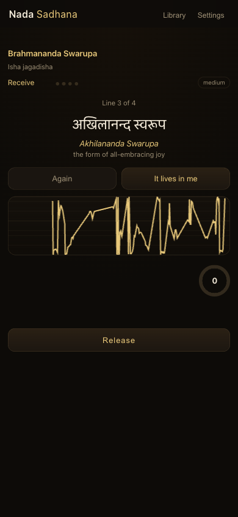
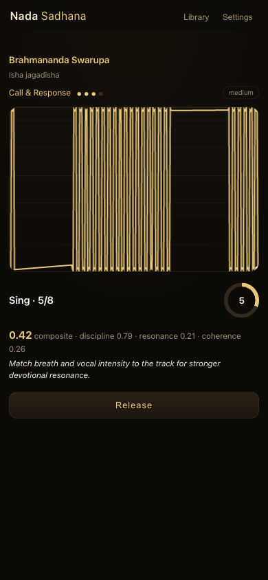
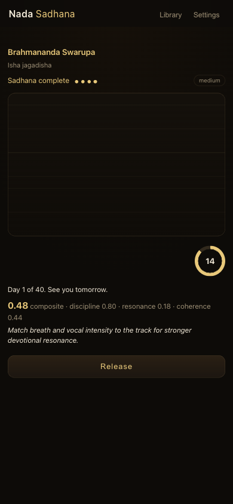

# The Little Tree Thinks

**A 48-hour field study in developer ecosystems, told through PrismML's Bonsai —
from a hostile model card to a shipped product to a counted mandala.**

Hi, PrismML team. I'm Jai ([@chaiwithjai](https://twitter.com/chaiwithjai)). This repo is
my application for leading your developer community and ecosystem — except instead of a
resume, it's the work itself: I took Ternary-Bonsai from your Hugging Face page to a
**live local server**, refactored a **real production app** onto it, **audited and fixed**
that app against its actual job, and **documented every footgun** a developer hits along
the way. Everything below is reproducible and every claim has an artifact.

## The numbers (all verified on an M4 Pro, stock Homebrew llama.cpp)

| What | Result |
|---|---|
| Ternary-Bonsai-1.7B F16, Metal | **125.8 tok/s**, 3.2GB |
| Mainline `llama-quantize F16 → TQ2_0` | **590MB @ 2.88 BPW, 111 tok/s** — the fork-gated density win, recovered inside verified tooling |
| Real app integration | Gemini cloud SDK fully replaced by Bonsai-local; 14/14 tests; grammar-constrained JSON the model *cannot* get wrong |
| Adoption blockers documented | **15 footguns**, each with a reproduction and a fix |
| Time from model card → shipped case study | ~48 hours |

## The story (read these in order)

1. **[docs/JOURNEY.md](docs/JOURNEY.md)** — the raw field log. Three acts: validating
   Bonsai against unreliable synthetic intel; forging a product on top of it; then
   auditing that product against its job-to-be-done and fixing what failed.
2. **[docs/CHRONICLE.md](docs/CHRONICLE.md)** — the same campaign as an embedded-journalist
   narrative. This is the social-content engine: every dispatch decomposes into a thread,
   a short, or a talk beat. *"Fluent intel is not verified intel"* is the through-line.
3. **[docs/SETUP.md](docs/SETUP.md)** — the reproducible setup: two commands to a running
   Bonsai server, plus the footguns that cost me hours so they cost you minutes.
4. **[docs/SERVICE_BLUEPRINT.md](docs/SERVICE_BLUEPRINT.md)** — product direction for the
   demo app, reasoned as a service blueprint: what Simply Sing / Yousician get right,
   translated into a single-URL, privacy-first, on-device experience.
5. **[docs/PRISMML_PITCH_5SLIDE.md](docs/PRISMML_PITCH_5SLIDE.md)** — how I'd build your
   DevRel engine: case studies that drive sales, marquee partnerships (SPC, AI Engineer
   Summit, upstreaming your kernels to mainline llama.cpp), and a funnel that makes DevRel
   measurable. ([15-slide deep version](docs/PRISMML_PITCH.md).)

## The demo app

**Nada Sadhana** — AI-assisted kirtan/mantra practice, stunning on mobile, running
entirely on Bonsai-local. The WebAudio engine never pauses mid-stage; pitch detection
runs in an AudioWorklet and **raw audio never leaves the device**; Bonsai's guidance is
grammar-pinned so it can't even *emit* an off-key adaptation.

<p>
  
  
  
</p>

*Left to right: transmission (advancement earned by singing — the gate is verified to
reject 16 seconds of silent-room ambience), Call & Response on the audio clock with live
Bonsai scoring, and the first completed sadhana writing "Day 1 of 40."*

## Why this is a DevRel application

Your hardest problem isn't model quality — I measured the model; it's excellent. It's
that **developers churn silently**: Bonsai-8B-Q1_0 *loads* on stock llama.cpp and then
runs ~1000x slow through a fallback path. No error, no issue filed — the developer just
leaves believing "Bonsai is slow." Fifteen documented footguns in this repo are fifteen
silent exits happening at scale right now.

What I do about it, demonstrated here:

- **Case studies that sell** — this repo is the format: real build, real numbers, a
  narrative worth sharing, and a reproducible path a prospect's team can rerun.
- **Ecosystem world-building** — the Chronicle gives the work characters, canon, and
  lore. Developers don't join products; they join worlds with stories they can retell.
- **Public utilities** — the setup scripts, the footgun list, the grammar-as-contract
  pattern (decode-time schemas that make small models reliable) are all directly
  reusable by your community.
- **Measurement** — the pitch decks define the funnel (north star: verified production
  integrations per quarter; activation: time-to-first-token under 10 minutes).

## Reproduce it

```bash
brew install llama.cpp
# put Ternary-Bonsai GGUFs in models/ (HF: prism-ml/Ternary-Bonsai-1.7B-gguf)
./scripts/serve.sh          # F16 + Metal: 125 tok/s
./scripts/serve.sh tq2      # TQ2_0 + CPU: 590MB, 111 tok/s
```

Full instructions and the footgun list: [docs/SETUP.md](docs/SETUP.md).

---

*Built with stock tooling, zero untrusted code, and a teacher in the loop.
jai.ghodwala@gmail.com*
