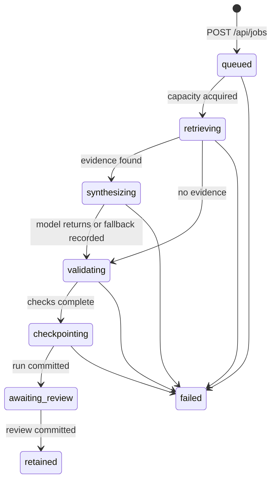

# RFC: Explicit finite-state execution for the Bonsai agent harness

| Field | Value |
| --- | --- |
| Status | Implemented prototype; superseded for creative work |
| Authors | Bonsai Workbench |
| Updated | 2026-07-22 |
| PRD | `docs/PRD_AGENT_HARNESS.md` |

HashiCorp uses an RFC after the PRD to propose the solution and surface unknowns early. Its guidance favors a short background and proposal that allow non-core reviewers to exit early, followed by implementation detail for stakeholders. Reference: [HashiCorp writing practices and culture](https://www.hashicorp.com/en/how-hashicorp-works/articles/writing-practices-and-culture).

## TL;DR

This RFC describes the current text and HTML harness. The creative artifact
journey uses
`docs/evaluation/RFC-0002-CREATIVE-ARTIFACT-GRAPH.md` instead because creative
artifacts, decisions, checks, and jobs cannot share one state machine.

Replace the browser’s single synchronous `/api/run` call and inferred phases with a bounded job coordinator and one explicit finite-state machine. `POST /api/jobs` accepts work and returns immediately. The browser polls `GET /api/jobs/:id`; server events advance the UI plan, activity, and adapter state. Completed artifacts remain in SQLite. Transport interruption is a client connectivity state, not a model failure.

## Background

The harness already has sound boundaries for catalog policy, model adapters, evaluation service, and run persistence. The execution lifecycle was still implicit: the service performed retrieval, inference, validation, and persistence inside one request while the browser displayed a generic running state. When that fetch failed, the browser marked synthesis blocked based on a hardcoded plan mapping. This could not establish which stages actually ran.

The measured workload makes the flaw visible: retrieval p95 is approximately 48 ms, while current text synthesis is 37–54 seconds. A long-lived HTTP call is therefore being used as a state protocol.

## Proposal

Introduce a job coordinator with a capacity semaphore, server-owned transition validation, pollable snapshots, and stage events. Mirror the same state contract in a small pure browser module that replays server events and refuses illegal transitions. Make the server snapshot authoritative; make the browser a projection.

### Execution state machine



`unreachable` is intentionally not a server state. It is a browser connectivity condition created when job submission or polling cannot reach the local server. This prevents a transport problem from fabricating a failed server stage.

### State invariants

1. A job ID is immutable.
2. State moves only through the declared directed graph.
3. `failed` is terminal and includes `failed_stage`, error kind, message, and retryability.
4. `awaiting_review` implies a durable run with an ID.
5. `retained` is projected from the durable run’s review, not from an in-memory timer.
6. A retry creates a new job. It never mutates the failed job or overwrites a prior run.
7. The plan is a projection of state; it is not an independent store.

## API contracts

### Submit

`POST /api/jobs`

```json
{
  "case_id": "dharma-method",
  "question": "What does the workshop method say about motivation?",
  "corpus": "dharma"
}
```

Returns HTTP 202:

```json
{
  "job": {
    "id": "…",
    "state": "queued",
    "created_at": 1784752000.0,
    "updated_at": 1784752000.0,
    "events": [{"state": "queued", "at": 1784752000.0}],
    "run": null,
    "error": null,
    "failed_stage": null
  }
}
```

### Observe

`GET /api/jobs/:id` returns the complete job snapshot. Polling is initially 400 ms because all deployment is loopback-only and concurrency is one. An event stream can replace polling without changing the job representation.

### Review

`POST /api/review` remains unchanged. On success, the durable run contains the review and the browser projects `retained`.

### Compatibility

`POST /api/run` remains temporarily available for CLI and existing callers. New UI work must use `/api/jobs`. Remove the synchronous route only after its callers are inventoried.

## Components

### `RunStateMachine`

The server implementation validates legal transitions and fails closed. It has no I/O and is contract-tested.

### `RunCoordinator`

- Accepts validated jobs.
- Uses a semaphore configured by `BONSAI_MAX_CONCURRENT_RUNS` (default 1).
- Maintains bounded recent job snapshots.
- Executes the existing `EvaluationService` on a daemon worker.
- Records transition timestamps and stage details.
- Converts unexpected exceptions into terminal failure metadata.

### `EvaluationService` observer

The service emits `retrieving`, `synthesizing`, `validating`, and `checkpointing` transitions at the real boundaries. It remains usable synchronously when no observer is supplied.

### Browser FSM

`web/fsm.js` is a dependency-free module that:

- replays server event history;
- validates every newly observed transition;
- projects plan statuses;
- distinguishes `unreachable` from `failed`;
- hydrates retained historical runs without inventing intermediate events.

The UI does not advance stages using elapsed time.

## Persistence and recovery

Completed runs and reviews are durable in SQLite. Active job snapshots are currently process-local and explicitly described as ephemeral. If the server restarts during inference, the browser receives job-not-found and presents an interrupted/retry path; previously committed sessions remain intact.

The next durability increment should add a `jobs` journal table and mark nonterminal jobs `interrupted` at process startup. Resuming within a model generation is out of scope; recovery begins from the accepted task or last committed artifact.

## Concurrency and backpressure

Text inference is the constrained allocation. The reference host has 24 GB unified memory and runs a local 27B model. Default concurrency is one; subsequent jobs remain `queued`. Control-plane reads, reviews, and retrieval remain concurrent through the threaded HTTP server.

This follows the useful part of Nomad’s model without requiring Nomad: jobs describe desired work, evaluations produce allocations, and feasibility/capacity precede execution. HashiCorp’s Nomad documentation separates requested task resources from placement and uses reservations plus hard limits to balance utilization against failure. References: [Nomad scheduling lifecycle](https://developer.hashicorp.com/nomad/docs/concepts/scheduling/how-scheduling-works) and [Nomad resources](https://developer.hashicorp.com/nomad/docs/job-specification/resources).

## Failure taxonomy

| Kind | Owner | State | Retry behavior |
| --- | --- | --- | --- |
| Transport/unreachable | Browser ↔ local HTTP | `unreachable` | Reconnect, then submit a new job. |
| Validation | API input | HTTP 400, no job | Correct input. |
| Retrieval exception | Server | `failed`, stage `retrieving` | Retry after index repair. |
| Model unavailable/timeout | Adapter | Retained fallback when safely representable; otherwise `failed`, stage `synthesizing` | Check adapter, retry. |
| Citation/check exception | Server | `failed`, stage `validating` | Fix contract/checker, retry. |
| SQLite failure | Server | `failed`, stage `checkpointing` | Repair storage; artifact is not claimed durable. |
| Review validation | API | HTTP 400; run remains awaiting review | Correct taxonomy/verdict. |

## Security and privacy

- The server binds to `127.0.0.1` by default.
- Model API traffic is loopback-only.
- Image generation forces `HF_HUB_OFFLINE=1`.
- Generated file serving validates a basename and `.png` suffix.
- The status API should avoid exposing absolute private source paths; individual evidence remains local and operator-visible.
- Any future non-loopback binding requires authentication, CSRF protection, origin policy, and a separate RFC.

## Observability

Every job must expose timestamps per state. Derived metrics:

- queue wait: `retrieving.at - queued.at`;
- retrieval latency: next stage minus `retrieving.at`;
- synthesis latency: `validating.at - synthesizing.at`;
- validation latency: `checkpointing.at - validating.at`;
- checkpoint latency: `awaiting_review.at - checkpointing.at`;
- terminal error rate by `failed_stage` and error kind;
- review latency: `reviewed_at - awaiting_review.at` once job/run linkage is journaled.

## Alternatives considered

### Keep a single synchronous request

Rejected. It cannot distinguish model time from transport state and makes restart behavior ambiguous.

### Simulate phases with browser timers

Rejected. It makes the interface smoother by becoming less truthful.

### Adopt a general workflow engine immediately

Deferred. It would add operational weight before workload and recovery requirements are proven. The API/state contract intentionally leaves room for replacing the in-process coordinator later.

### Allow unlimited concurrent inference

Rejected. The constrained local host would trade queue visibility for memory pressure, unpredictable latency, and likely failures.

## Rollout plan

1. **Contract:** Land server and browser FSMs, transition tests, async job API, and one-job capacity.
2. **Projection:** Derive plan, activity, state pills, and adapter activity from the FSM only.
3. **Evidence:** Record per-stage duration metrics and run the canonical workload profile.
4. **Recovery:** Add durable job journal and explicit `interrupted` startup recovery if the PRD open question resolves in favor of in-flight durability.
5. **Scale gate:** Increase concurrency only after a stress test proves memory headroom and does not regress p95/error targets.

## Risks and mitigations

| Risk | Impact | Mitigation |
| --- | --- | --- |
| Poll misses fast states | UI skips visible detail | Replay complete ordered event history, not only the latest state. |
| Browser/server state drift | Contradictory plan | Browser validates event transitions and reports drift as connectivity/contract failure. |
| Process restart loses active job | Operator cannot inspect terminal status | Label active state ephemeral; add job journal before claiming durable execution. |
| Queue starvation from hung model | Later jobs wait indefinitely | Adapter timeout, terminal failure, and future cancellation endpoint. |
| Sensitive error text leaks paths | Local UI reveals more than needed | Normalize public errors; retain detailed diagnostics locally. |

## Unresolved questions

1. Should cancellation be a terminal `cancelled` state in v1 or after durable journaling?
2. Should image and text jobs use one device budget or independent queues?
3. Is polling sufficient locally, or should Server-Sent Events be adopted once stage metrics land?
4. What exact database schema and restart semantics are required for durable active jobs?
