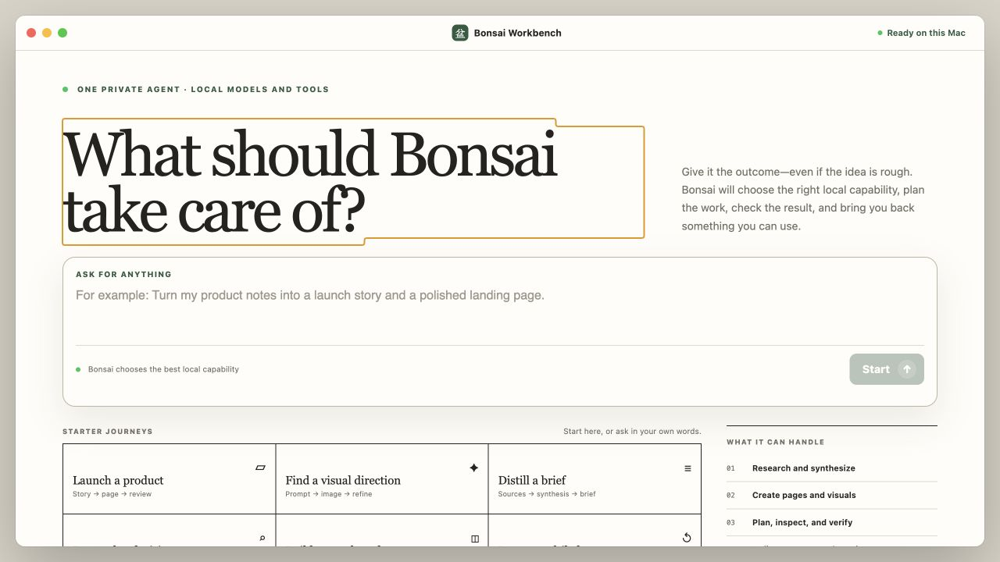
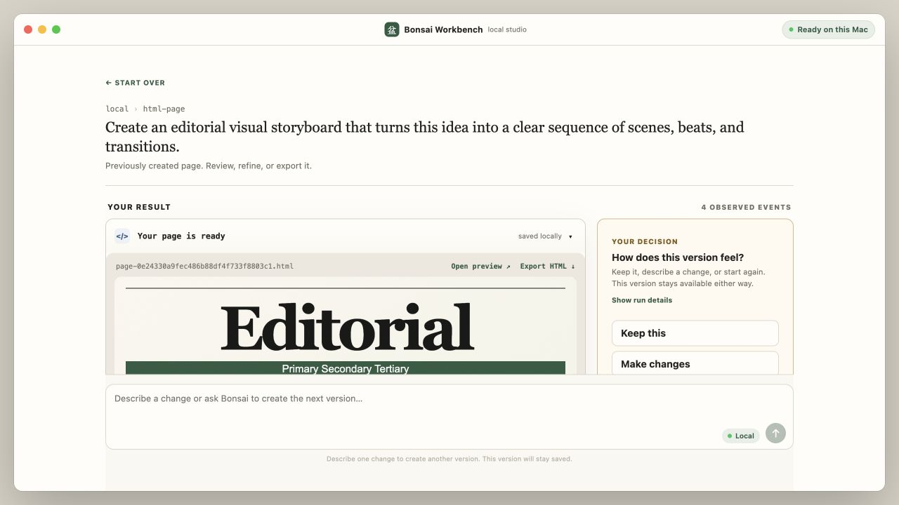
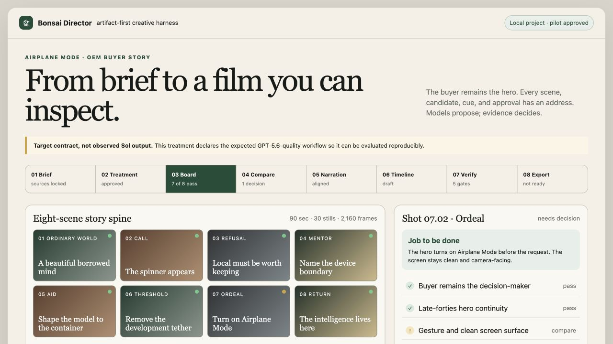
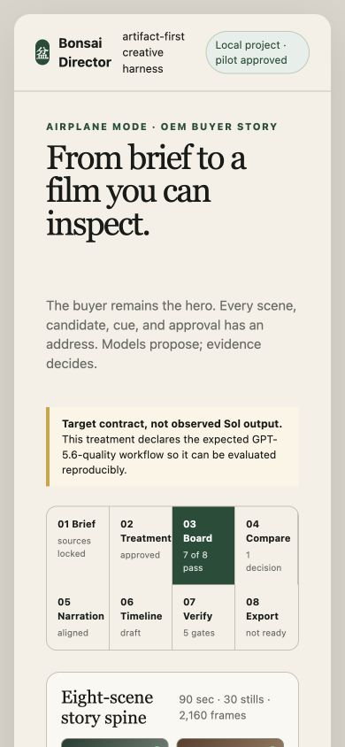
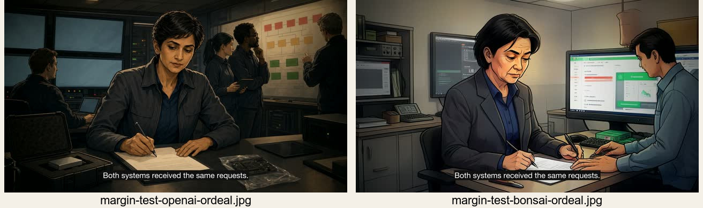
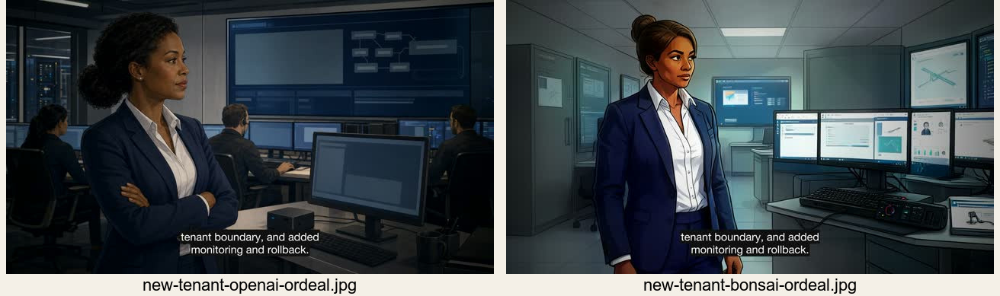

# Bonsai creative-harness evaluation

This package evaluates two connected systems:

1. Bonsai Workbench, the local agent interface in this repository.
2. The three-film production in `whatif/productions/bonsai-persona-films`.

The comparison target is the requested **GPT-5.6 / “Sol 5.6” quality bar**. No
recorded Sol reference run exists in the local evidence. The target column is
therefore a **declared product contract**, not a claim about an unseen model
output. Directly observed facts and inferred target behavior are kept separate.

## Executive finding

The last production pass proves that the story is reproducible, but not yet
agentically authorable from one brief.

- The production pipeline validates all three 90-second films: 30 generated
  stills per film, 24 fps delivery, and 6,480 rendered frames in total.
- Bonsai and OpenAI provider cuts both exist for all three personas.
- The polished cuts repair the large narration gaps, add a continuous score,
  story cards, and burned captions.
- The Workbench can create and retain HTML artifacts, but its storyboard mode
  currently produces a generic editorial page rather than a scene/beat system.
- The film pipeline is capable; the interface does not yet expose its real
  checkpoints, provider comparisons, continuity controls, or targeted repair
  operations.

The architectural gap is not “use a smarter model.” It is a missing typed
artifact graph between intent, story, shot, media, timeline, QA, approval, and
export.

## Evidence snapshot

| Evidence | Observed result |
|---|---|
| Local Workbench jobs | 23 total; 17 awaiting review; 6 failed (26.1%) |
| Failure classes | restart, timeout, missing variable, incomplete HTML |
| HTML artifacts | 14 retained |
| Storyboard HTML | Complete document, but generic content, duplicated IDs, mojibake, and no scene/beat representation |
| Persona-film validation | 3 films, 90 stills, 270 seconds, 6,480 frames |
| Provider matrix | Bonsai and OpenAI cuts for all three films |
| Audio | 90-second AAC tracks in all six polished outputs |
| Remaining caption limitation | Caption duration is allocated by word count inside each narration segment; no forced alignment |
| Bonsai image strength | Local, seeded, cartoon direction, reusable pipeline |
| Bonsai image weakness | Fine UI/gesture legibility and cross-shot identity consistency |
| OpenAI image strength | Cinematic composition, gesture fidelity, cleaner screen surface |
| OpenAI image weakness | No seed control in the recorded comparison; cloud dependency |

## Screenshots

### Current Day 0 journey

The arrival screen is clear and polished. Its weakness is after submission:
“Build a storyboard” is presented as a journey, but the underlying result type is
still a generic HTML page.

### Current storyboard run

The review shell is directionally right: result first, decision beside it, and
refinement in the same place. The artifact contract is wrong, so the reviewer is
being asked to approve a page that does not represent the requested story.

### Current generated artifact

The output is an editorial layout titled “The Architecture of Silence.” It does
not show the buyer persona, Campbell beats, scenes, shot timing, transitions,
audio, continuity, or provider choice.

### Declared 5.6 target contract

This is a product treatment of the expected interface, not a screenshot of an
unavailable Sol run. It makes the inference boundary explicit: story planning,
artifact generation, provider comparison, verification, and approval are
addressable stages with typed outputs.

### Responsive target treatment

At a 390 × 844 viewport, the target preserves the full journey, readable type,
and two-column artifact cards without horizontal overflow. Browser inspection
also found no console errors at desktop or mobile widths.

### Approved storyboard spine

The eight-panel board demonstrates what the HTML generator missed: a consistent
hero, a causal sequence, a visible ordeal, and a final return.

### Provider delta at the decisive gesture

The recorded comparison found:

- OpenAI: passes story beat, hero continuity, gesture, clean overlay surface,
  and visual style.
- Bonsai: passes hero continuity and visual style, partially passes story beat
  and gesture, and fails the clean overlay surface.

### Film-frame provider deltas

At the 45-second beat, Bonsai consistently delivers the requested animated,
illustrative register. OpenAI is more cinematic and materially detailed.
Bonsai's Airplane Mode frame also exposes identity drift across a single shot:
the foreground and background men do not read as one continuous protagonist.

## What was not technically feasible in the first pass

### 2,160 generated stills per film

At 24 fps, a 90-second film contains 2,160 **rendered frames**, not 2,160 useful
diffusion prompts. Generating every frame independently would destroy temporal
coherence, multiply cost and runtime, and create flicker. The feasible design is
what the production now uses: 30 stills across eight scenes, transformed into
2,160 frames through camera motion, layered depth, transitions, captions, and
audio.

### Unbounded parallel local generation

The provider paths can be scheduled in parallel, but local Bonsai diffusion and
local Liquid audio compete for the same machine envelope. The safe unit of
parallelism is a bounded job queue with resource classes, not one process per
shot. A pilot gate before 90 stills is the correct protection.

### One-pass 90-second narration

Liquid audio was reliable enough to narrate, but a single long generation was
not reliable enough for timing and repair. Segmenting by act—and later by
sentence—made regeneration addressable. The post pass rebuilt the narration
timeline, normalized it, padded it to 90 seconds, and added a ducked score.

### Caption truth without alignment data

The first captions were derived from the script rather than the actual waveform.
The current pass improves chunking and shares segment start times with the
repaired narration, but it still allocates caption duration in proportion to
word count. Exact Netflix-style synchronization requires forced alignment or
timestamped TTS output.

### Fully automatic cinematic coherence

A text prompt alone did not preserve protagonist identity, gesture, screen
content, and environment across 30 independent generations. Continuity JSON,
fixed seeds, provider-specific prompts, pilot approval, and targeted regeneration
made the films coherent enough to cut. Stronger coherence requires reference
image conditioning or identity/style embeddings, neither of which is present in
the recorded local Bonsai path.

## Current versus target journey

| Stage | Current Bonsai | 5.6 target contract |
|---|---|---|
| Orient | Strong Day 0 promise and starter journeys | Add evidence of what each journey produces |
| Prompt | One natural-language composer | Composer plus attached brief, references, and explicit deliverable |
| Configure | Mode/page/corpus controls | Progressive configuration for duration, provider, style, privacy, and budget |
| Plan | Generic finite-state plan | Typed story plan: treatment → scenes → shots → media → timeline |
| Generate | One model produces a monolithic artifact | Provider fan-out at shot granularity with bounded concurrency |
| Review | Result preview plus keep/change/restart | Storyboard contact sheet, timeline, continuity ledger, and A/B provider compare |
| Tweak | Free-form “make changes” | Addressable repair: scene, shot, narration segment, caption cue, or score |
| Verify | HTML validity and run trace | Narrative, continuity, media, audio, caption, accessibility, and export gates |
| Use/export | HTML preview/export | Storyboard, manifests, edit project, captions, audio stems, and final movie |

## Inference comparison

The observed provider delta is smaller than the harness delta.

| Layer | Bonsai local inference | OpenAI inference | Harness responsibility |
|---|---|---|---|
| Story reasoning | Not the image model's job | Not the image model's job | Preserve buyer-as-hero and causal beats in typed story data |
| Image composition | Strong style; weaker small UI/gesture detail | Strong cinematic specificity | Give both providers the same shot contract |
| Identity continuity | Seeded but not sufficient across independent shots | Better in sampled frames, still not guaranteed | References, continuity checks, regenerate only the failed shot |
| Determinism | Seed recorded | No seed control in recorded comparison | Record prompt, provider, model, seed, dimensions, and decision |
| Privacy/cost | Local path | Cloud path | Expose policy and resource trade-offs before execution |
| Editorial result | Cartoon treatment | Cinematic treatment | Allow provider choice per shot rather than per film |

The recommendation is a **portfolio renderer**. Keep story and acceptance
criteria provider-neutral, then choose the least expensive provider that passes
each shot's gate. The current all-Bonsai versus all-OpenAI films are useful
experiments, not the optimal production policy.

## Artifacts

- [`scorecard.json`](scorecard.json) — machine-readable evaluation.
- [`sol-5-6-target.html`](sol-5-6-target.html) — declared target interface
  treatment.
- [`RFC-0002-CREATIVE-ARTIFACT-GRAPH.md`](RFC-0002-CREATIVE-ARTIFACT-GRAPH.md)
  — proposed architecture.
- [`ARCHITECTURE-REVIEW.md`](ARCHITECTURE-REVIEW.md) — independent systems
  critique and go/no-go gates.
- [`DESIGN-TREATMENTS.md`](DESIGN-TREATMENTS.md) — three interface directions.
- [`ISSUE.md`](ISSUE.md) — GitHub issue source.
